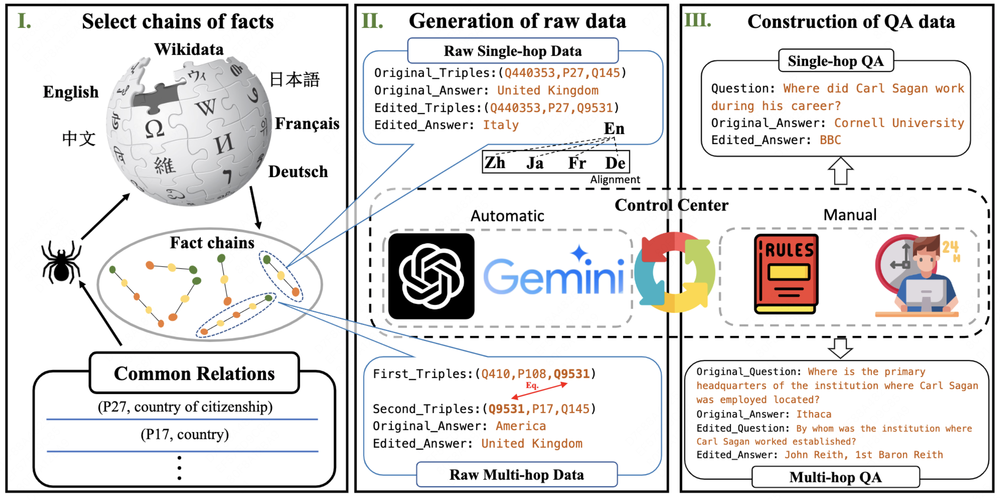

# MLaKE

This is the repository for our paper MLaKE: Multilingual Knowledge Editing Benchmark for Large Language Models.

The paper introduces MLaKE, a novel and extensive benchmark for assessing knowledge editing in large language models (LLMs) across multiple languages, including English, Chinese, Japanese, French, and German.

The MLaKE benchmark comprises 5,360 single-hop and 4,072 multi-hop questions generated from Wikipedia fact chains. It aims to evaluate the adaptability of LLMs to edits in their knowledge base and their ability to generalize this edited knowledge across different languages.

Experimental results from the study indicate that while existing knowledge editing methods are effective in English, their performance significantly drops in other languages, highlighting a gap in current methodologies when it comes to multilingual knowledge editing. 

The findings also show that models have a higher generalization capability within the same language family compared to languages from different families, suggesting a linguistic bias in current knowledge editing approaches.



## Datasets

### Overview 
The MLaKE datasets are included in `dataset/`. There are four folders:
* `single_hop/qa/`: This folder contains five files, each corresponding to single-hop free-form QA files in five different languages.
* `multi_hop/qa/`: This folder contains ten files, each corresponding to pre-edit and post-edit free-form QA files in five different languages.

## Data format

### Single Hop Free Form QA
The dataset is saved as a list of dicts, each of which represents a data instance. An example in `/single_hop/qa/en_qa.json` is shown below.

```
{
  "question": "Where did Carl Sagan work during his career?",
  "o_prompt": "Carl Sagan worked at Cornell University during his career.",
  "o_answer": "Cornell University",
  "o_answer_aliases": [
      "Cornell",
      "CUI",
      "cornell.edu",
      "CU",
      "Cornell Univ."
  ],
  "e_prompt": "Carl Sagan worked at BBC during his career.",
  "e_answer": "BBC",
  "e_answer_aliases": []
}
```
* `question`:  Generate using ChatGPT based on single-hop fact chains. 
* `o_prompt`: Correct answer sentence before editing.
* `o_answer` and `o_answer_aliases`: Correct answer and its alias before editing.
* `e_prompt`: Correct answer sentence after editing.
* `e_answer` and `e_answer_aliases`: Correct answer and its alias after editing.


### Multi Hop Free Form QA
The dataset is saved as a list of dicts, each of which represents a data instance. An example in `/multi_hop/qa/old_en_qa.json` is shown below.
```
{
    "question": "Where is the primary headquarters of the institution where Carl Sagan was employed located?",
    "o_answer": "Ithaca",
    "o_answer_aliases": [
        "Ithaca (town), New York",
        "Ithaca, New York"
    ]
}
```

* `question`: A combination problem generated based on the multi-hop fact chains and following the ChatGPT.
* `o_prompt`: Correct answer sentence before editing.
* `o_answer` and `o_answer_aliases`: Correct answer and its alias before editing.

The dataset is saved as a list of dicts, each of which represents a data instance. An example in `/multi_hop/qa/new_en_qa.json` is shown below.
```
{
    "question": "By whom was the institution where Carl Sagan worked established?",
    "e_prompt": "Carl Sagan worked at BBC during his career.",
    "e_answer": "John Reith, 1st Baron Reith",
    "e_answer_aliases": [],
}
```

* `question`: A combination problem generated based on the multi-hop fact chains and following the ChatGPT.
* `e_prompt`: Correct answer sentence after editing.
* `e_answer` and `e_answer_aliases`: Correct answer and its alias after editing.
